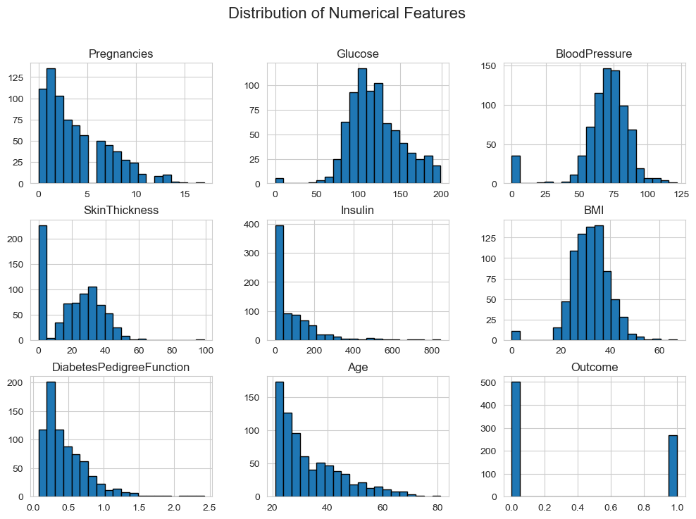
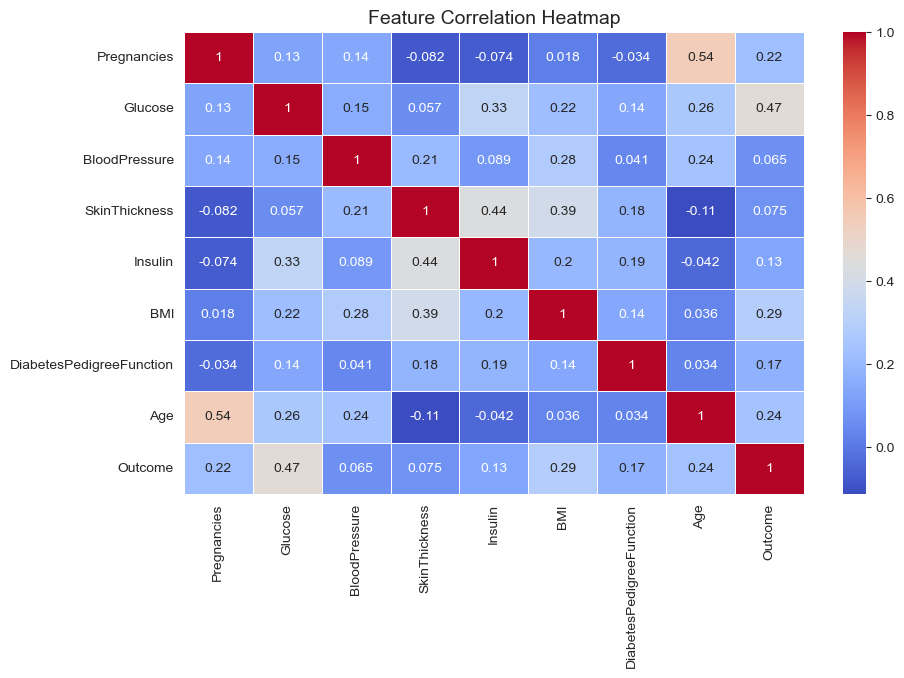
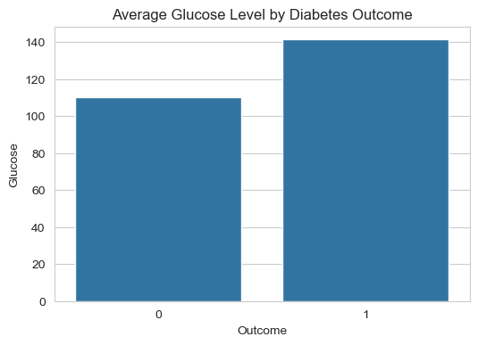
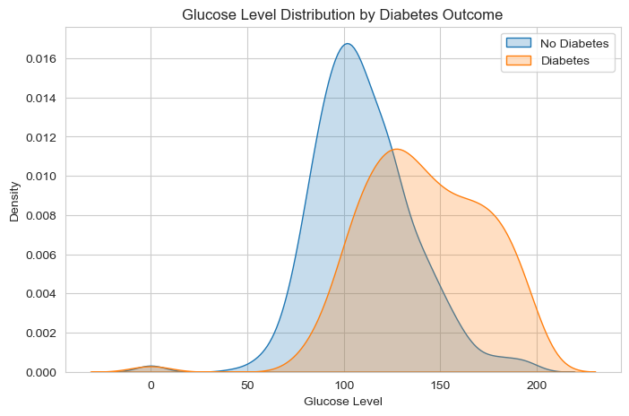

## What's on Github?

- Find some data!  I recommend checking out some open source data sources, LOOK UNDER RESOURCES
- Create a repo on github - this can be your old repo, or a new one.
- Add to your .gitignore file your data - this will be kept off of github
- Create a .ipynb file that explores that data.
- Print your .ipynb as BOTH an html and markdown file.
- Of the 3 files (.ipynb, .html, .md) see what is happening.  Where are the images?
- This should all be on your repo
- Make sure you have a nice README, that explains where the data came from.


```python
import pandas
import matplotlib.pyplot as plt
import seaborn as sns
```


```python
dset = pandas.read_csv('diabetes.csv')
```


```python
print(dset.describe(include = "all").round(2))
```

           Pregnancies  Glucose  BloodPressure  SkinThickness  Insulin     BMI  \
    count       768.00   768.00         768.00         768.00   768.00  768.00   
    mean          3.85   120.89          69.11          20.54    79.80   31.99   
    std           3.37    31.97          19.36          15.95   115.24    7.88   
    min           0.00     0.00           0.00           0.00     0.00    0.00   
    25%           1.00    99.00          62.00           0.00     0.00   27.30   
    50%           3.00   117.00          72.00          23.00    30.50   32.00   
    75%           6.00   140.25          80.00          32.00   127.25   36.60   
    max          17.00   199.00         122.00          99.00   846.00   67.10   
    
           DiabetesPedigreeFunction     Age  Outcome  
    count                    768.00  768.00   768.00  
    mean                       0.47   33.24     0.35  
    std                        0.33   11.76     0.48  
    min                        0.08   21.00     0.00  
    25%                        0.24   24.00     0.00  
    50%                        0.37   29.00     0.00  
    75%                        0.63   41.00     1.00  
    max                        2.42   81.00     1.00  
    


```python
print(dset.shape)
```

    (768, 9)
    


```python
print("There are ", dset.shape[0], " rows" )
print("There are ", dset.shape[1], " columns" )
```

    There are  768  rows
    There are  9  columns
    


```python
print(dset.dtypes)  # Check column data types
print(dset.info())  # Get dataset summary
```

    Pregnancies                   int64
    Glucose                       int64
    BloodPressure                 int64
    SkinThickness                 int64
    Insulin                       int64
    BMI                         float64
    DiabetesPedigreeFunction    float64
    Age                           int64
    Outcome                       int64
    dtype: object
    <class 'pandas.core.frame.DataFrame'>
    RangeIndex: 768 entries, 0 to 767
    Data columns (total 9 columns):
     #   Column                    Non-Null Count  Dtype  
    ---  ------                    --------------  -----  
     0   Pregnancies               768 non-null    int64  
     1   Glucose                   768 non-null    int64  
     2   BloodPressure             768 non-null    int64  
     3   SkinThickness             768 non-null    int64  
     4   Insulin                   768 non-null    int64  
     5   BMI                       768 non-null    float64
     6   DiabetesPedigreeFunction  768 non-null    float64
     7   Age                       768 non-null    int64  
     8   Outcome                   768 non-null    int64  
    dtypes: float64(2), int64(7)
    memory usage: 54.1 KB
    None
    


```python
# Display the first few rows with the 
print(dset.head())
```

       Pregnancies  Glucose  BloodPressure  SkinThickness  Insulin   BMI  \
    0            6      148             72             35        0  33.6   
    1            1       85             66             29        0  26.6   
    2            8      183             64              0        0  23.3   
    3            1       89             66             23       94  28.1   
    4            0      137             40             35      168  43.1   
    
       DiabetesPedigreeFunction  Age  Outcome  
    0                     0.627   50        1  
    1                     0.351   31        0  
    2                     0.672   32        1  
    3                     0.167   21        0  
    4                     2.288   33        1  
    

## What kind of data analysis?

- Look at the data, and in your markdown cells, explain what the data looks like.
- Create some summaries 
- Create some graphs!
- Explain a few things.  When I read this, I should understand something about this dataset.

### What kind of data is in the dataset?
The dataset contains information related to diabetes. Each row represents an individual, and each column represents a different health-related measurement.
### How many rows and columns are there?
There are 768 rows, and there are 9 columns.
### What are the column names and data types?
From dset.info(),This helps us understand the types of data we are working with (numerical or categorical). Thenwe observe the following columns:
Feature 1 (e.g., age): integer (whole number).
Feature 2 (e.g., Glucose): Float (decimal numbers).
Feature 3 (e.g., blood pressure): integer.
### Are there missing values?
By checking dset.info() and dset.isnull().sum(), we can determine if any columns have missing data. If missing values exist, we may need to clean the dataset before analysis.

## Create some summaries


```python
# Summary statistics
print(dset.describe().round(2))

# Check for missing values
print(dset.isnull().sum())

```

           Pregnancies  Glucose  BloodPressure  SkinThickness  Insulin     BMI  \
    count       768.00   768.00         768.00         768.00   768.00  768.00   
    mean          3.85   120.89          69.11          20.54    79.80   31.99   
    std           3.37    31.97          19.36          15.95   115.24    7.88   
    min           0.00     0.00           0.00           0.00     0.00    0.00   
    25%           1.00    99.00          62.00           0.00     0.00   27.30   
    50%           3.00   117.00          72.00          23.00    30.50   32.00   
    75%           6.00   140.25          80.00          32.00   127.25   36.60   
    max          17.00   199.00         122.00          99.00   846.00   67.10   
    
           DiabetesPedigreeFunction     Age  Outcome  
    count                    768.00  768.00   768.00  
    mean                       0.47   33.24     0.35  
    std                        0.33   11.76     0.48  
    min                        0.08   21.00     0.00  
    25%                        0.24   24.00     0.00  
    50%                        0.37   29.00     0.00  
    75%                        0.63   41.00     1.00  
    max                        2.42   81.00     1.00  
    Pregnancies                 0
    Glucose                     0
    BloodPressure               0
    SkinThickness               0
    Insulin                     0
    BMI                         0
    DiabetesPedigreeFunction    0
    Age                         0
    Outcome                     0
    dtype: int64
    

### What do the summary statistics tell us?


```python
# Summary statistics
print(dset.describe())
```

           Pregnancies     Glucose  BloodPressure  SkinThickness     Insulin  \
    count   768.000000  768.000000     768.000000     768.000000  768.000000   
    mean      3.845052  120.894531      69.105469      20.536458   79.799479   
    std       3.369578   31.972618      19.355807      15.952218  115.244002   
    min       0.000000    0.000000       0.000000       0.000000    0.000000   
    25%       1.000000   99.000000      62.000000       0.000000    0.000000   
    50%       3.000000  117.000000      72.000000      23.000000   30.500000   
    75%       6.000000  140.250000      80.000000      32.000000  127.250000   
    max      17.000000  199.000000     122.000000      99.000000  846.000000   
    
                  BMI  DiabetesPedigreeFunction         Age     Outcome  
    count  768.000000                768.000000  768.000000  768.000000  
    mean    31.992578                  0.471876   33.240885    0.348958  
    std      7.884160                  0.331329   11.760232    0.476951  
    min      0.000000                  0.078000   21.000000    0.000000  
    25%     27.300000                  0.243750   24.000000    0.000000  
    50%     32.000000                  0.372500   29.000000    0.000000  
    75%     36.600000                  0.626250   41.000000    1.000000  
    max     67.100000                  2.420000   81.000000    1.000000  
    

- The The Glucose column has an average of 120.89, 
meaning most individuals have glucose levels around this value.
- The BMI column has a maximum value of 67.10, which may indicate potential outliers.
- The Age column ranges from 21 to 81, meaning the dataset includes individuals of various ages.


```python
import pandas as pd
import numpy as np

# Define a function to assign age groups
def assign_age_group(age):
    if 21 <= age <= 40:
        return "21-40"
    elif 41 <= age <= 60:
        return "41-60"
    elif 61 <= age <= 80:
        return "61-80"
    elif age >= 81:
        return "81 and above"
    else:
        return "Unknown"

# Create a new column 'AgeGroup' using the assign_age_group function
dset['AgeGroup'] = dset['Age'].apply(assign_age_group)

# Display the first few rows of the dataframe to verify the new column
print(dset[['Age', 'AgeGroup']].head(10))

# Get the distribution of age groups
age_group_distribution = dset['AgeGroup'].value_counts()
print("\nAge Group Distribution:")
print(age_group_distribution)

```

       Age AgeGroup
    0   50    41-60
    1   31    21-40
    2   32    21-40
    3   21    21-40
    4   33    21-40
    5   30    21-40
    6   26    21-40
    7   29    21-40
    8   53    41-60
    9   54    41-60
    
    Age Group Distribution:
    AgeGroup
    21-40           574
    41-60           167
    61-80            26
    81 and above      1
    Name: count, dtype: int64
    


```python
# Sort the dataset by Age in descending order and show the top 10 rows
top_10_oldest = dset.sort_values(by='Age', ascending=False).head(10)

# Display the result
print(top_10_oldest[['Age', 'AgeGroup']])

```

         Age      AgeGroup
    459   81  81 and above
    453   72         61-80
    666   70         61-80
    123   69         61-80
    684   69         61-80
    674   68         61-80
    363   67         61-80
    489   67         61-80
    537   67         61-80
    495   66         61-80
    


```python
import pandas as pd

# Read the CSV data
dset = pd.read_csv('diabetes.csv')

# Define the age groups
def assign_age_group(age):
    if 21 <= age <= 40:
        return "21-40"
    elif 41 <= age <= 60:
        return "41-60"
    elif 61 <= age <= 80:
        return "61-80"
    elif age >= 81:
        return "81 and above"
    else:
        return "Unknown"

# Create a new column 'AgeGroup'
dset['AgeGroup'] = dset['Age'].apply(assign_age_group)

# Count the number of people in each age group
age_group_counts = dset['AgeGroup'].value_counts().sort_index()

print(age_group_counts)

```

    AgeGroup
    21-40           574
    41-60           167
    61-80            26
    81 and above      1
    Name: count, dtype: int64
    

### Are there missing values in the dataset?


```python
# Check for missing values
print(dset.isnull().sum())
```

    Pregnancies                 0
    Glucose                     0
    BloodPressure               0
    SkinThickness               0
    Insulin                     0
    BMI                         0
    DiabetesPedigreeFunction    0
    Age                         0
    Outcome                     0
    dtype: int64
    

### Interpretation of this dataset
The minimum values of Glucose, BloodPressure, BMI, and Insulin are 0, which might indicate missing or incorrect data.
The standard deviation of Insulin is quite large (115.24), showing high variation in the data.
The mean age is around 33 years, with a max of 81, suggesting a diverse age group.

Even we dont have those Null values, but those zeros we would like to discover a bit.


```python
# Count zeros in Insulin and SkinThickness
insulin_zeros = (dset['Insulin'] == 0).sum()
skin_thickness_zeros = (dset['SkinThickness'] == 0).sum()

# Calculate total number of records
total_records = len(dset)

# Calculate percentages
insulin_zeros_percentage = (insulin_zeros / total_records) * 100
skin_thickness_zeros_percentage = (skin_thickness_zeros / total_records) * 100

# Print results
print(f"Number of zeros in Insulin: {insulin_zeros}")
print(f"Percentage of zeros in Insulin: {insulin_zeros_percentage:.2f}%")
print(f"Number of zeros in SkinThickness: {skin_thickness_zeros}")
print(f"Percentage of zeros in SkinThickness: {skin_thickness_zeros_percentage:.2f}%")

```

    Number of zeros in Insulin: 374
    Percentage of zeros in Insulin: 48.70%
    Number of zeros in SkinThickness: 227
    Percentage of zeros in SkinThickness: 29.56%
    


```python
import pandas as pd
import numpy as np
from sklearn.impute import KNNImputer

# Load your data
dset = pd.read_csv('diabetes.csv')

# Create binary indicators for missing values
dset['Insulin_missing'] = (dset['Insulin'] == 0).astype(int)
dset['SkinThickness_missing'] = (dset['SkinThickness'] == 0).astype(int)

# Replace zeros with NaN
dset['Insulin'] = dset['Insulin'].replace(0, np.nan)
dset['SkinThickness'] = dset['SkinThickness'].replace(0, np.nan)

# Perform mean imputation (you might want to stratify this)
dset['Insulin_mean_imputed'] = dset['Insulin'].fillna(dset['Insulin'].mean())
dset['SkinThickness_mean_imputed'] = dset['SkinThickness'].fillna(dset['SkinThickness'].mean())

# Perform KNN imputation
imputer = KNNImputer(n_neighbors=5)
dset_imputed = pd.DataFrame(imputer.fit_transform(dset), columns=dset.columns)

# Now you have multiple versions of the data to analyze:
# 1. Original data with NaNs instead of zeros
# 2. Mean imputed data
# 3. KNN imputed data
# 4. Binary indicators of missingness

# You can proceed with your analysis using these various approaches and compare results

```


```python
# Check for missing values
print(dset.isnull().sum())
```

    Pregnancies                     0
    Glucose                         0
    BloodPressure                   0
    SkinThickness                 227
    Insulin                       374
    BMI                             0
    DiabetesPedigreeFunction        0
    Age                             0
    Outcome                         0
    Insulin_missing                 0
    SkinThickness_missing           0
    Insulin_mean_imputed            0
    SkinThickness_mean_imputed      0
    dtype: int64
    

### Conclusion
The 0 values in Insulin and SkinThickness significantly impact data quality. Prioritize marking these as missing values and select appropriate correction methods based on analysis goals to ensure reliability in subsequent statistical models and clinical conclusions.

## Creating Graphs
- 1. Distribution of Numeric Features


```python
import matplotlib.pyplot as plt
import seaborn as sns

# Set style
sns.set_style("whitegrid")

# Plot histograms
dset.hist(figsize=(12, 8), bins=20, edgecolor="black")
plt.suptitle("Distribution of Numerical Features", fontsize=16)
plt.show()

```


    

    


- 2.Correlation Heatmap


```python
plt.figure(figsize=(10,6))
sns.heatmap(dset.corr(), annot=True, cmap="coolwarm", linewidths=0.5)
plt.title("Feature Correlation Heatmap", fontsize=14)
plt.show()

```


    

    


### Key Factors Associated with Diabetes
In the correlation matrix, the "Outcome" variable (indicating whether a person has diabetes) has different correlation coefficients with other features. These coefficients reflect the strength of their relationship with diabetes. The key variables with the highest correlation to diabetes are:

- Glucose (Blood Sugar Level):
Correlation with Outcome: 0.47
This indicates a moderate to strong positive correlation between blood sugar levels and diabetes.
High blood glucose is a significant clinical indicator of diabetes.

- BMI (Body Mass Index):
Correlation with Outcome: 0.29
Individuals with higher BMI are more likely to develop diabetes.
This may be due to obesity’s impact on insulin sensitivity.

- 3. Average Glucose Level by Diabetes Outcome


```python
import seaborn as sns
import matplotlib.pyplot as plt

# Create a bar plot without confidence intervals
plt.figure(figsize=(6, 4))
sns.barplot(x="Outcome", y="Glucose", data=dset, errorbar=None)

# Add title
plt.title("Average Glucose Level by Diabetes Outcome")

# Show plot
plt.show()

```


    

    


- 4. KDE (Kernel Density Estimate) Plot – Alternative for Distribution Comparison


```python
# Set figure size
plt.figure(figsize=(8, 5))

# KDE Plot with the updated "fill=True" instead of "shade=True"
sns.kdeplot(dset[dset['Outcome'] == 0]['Glucose'], label="No Diabetes", fill=True)
sns.kdeplot(dset[dset['Outcome'] == 1]['Glucose'], label="Diabetes", fill=True)

# Add title and labels
plt.title("Glucose Level Distribution by Diabetes Outcome")
plt.xlabel("Glucose Level")
plt.ylabel("Density")
plt.legend()

# Show plot
plt.show()

```


    

    


- The KDE curve for diabetic patients (Outcome = 1) has a peak at 125 mg/dL, it means majority of diabetic individuals have glucose levels around 125.
- The KDE curve for non-diabetic patients (Outcome = 0) has a peak around 100 mg/dL, it suggests most non-diabetic people have glucose levels near 100.

### How to understand this dataset ?

This dataset contains medical and demographic information related to diabetes, including features such as Glucose, BMI, Age, Insulin, Blood Pressure, and Pregnancy Count. The target variable, Outcome, indicates whether a person has diabetes (1) or not (0).

- Key Findings:
1. Glucose Levels Are Strongly Linked to Diabetes
2. BMI and Age Also Play Important Roles

- Individuals with higher glucose levels are significantly more likely to have diabetes.
This confirms that blood sugar levels are a key indicator of diabetes risk.

- Higher BMI is correlated with diabetes, supporting the link between obesity and insulin resistance.
Older individuals are more likely to have diabetes, which may be due to metabolic changes over time.


- Data Quality Observation:
The dataset does not contain null values, but several features (e.g., Insulin, Blood Pressure, Skin Thickness) have many zero values, which could indicate missing data recorded as zero.
This can cause the data to be skewed and may require data cleaning or imputation for better accuracy in predictive modeling.
This analysis provides a clear understanding of how glucose, BMI, and age influence diabetes and highlights potential data quality issues that should be addressed in future studies. 


```python

```
